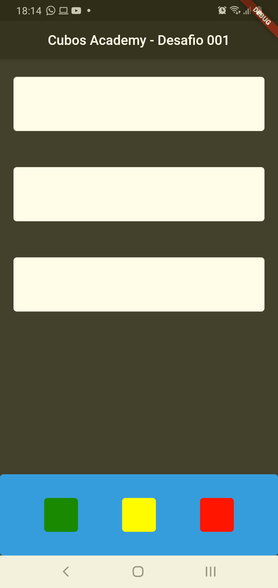

<h1 align="center">
    Cubos Academy  
</h1>

 Desafio de Componentização 
  

[//]: # (Adicione seus gifs / imagens aqui:)

 
   

## **Informações:**
[//]: # (Descreva seu objetivo e o que foi usado no projeto:)

* Desafio - Componentização.
* Construindo apenas com containers.

Obrigatório:

* Componentizar os cards brancos da coluna;
* Iniciar o git no projeto;

Opcional:

* Componentizar os containers da row parametrizando a cor;
* Fazer o commit da solução do exercicio;

Avançado:

* Separar os commits do projeto (Inicial e Componentização);
  

## **Linguagens e Ferramentas:**
[//]: # (Adicione os recursos do seu projeto aqui:)

- <code></code> **Flutter**
- <code></code> **Dart**